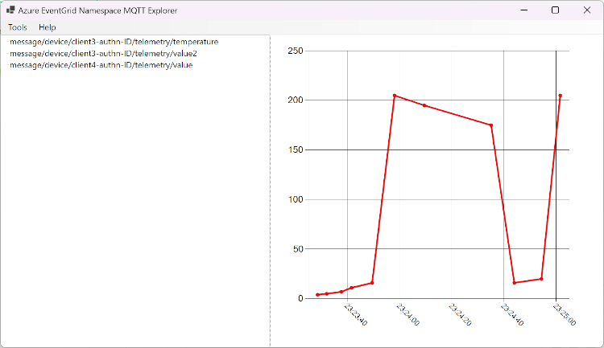

# Azure EventGrid namespace MQTT Explorer

This explorer tool can visualize all incoming Azure EventGrid namespace MQTT broker messages on all topics. An audit client simply listens to '#'.

Notice this only works when a specific MQTT broker client is created with this ability.

Depending on the first value received for a certain topic, a line chart or a list box is shown:



See also this [blog post](https://sandervandevelde.wordpress.com/2024/05/25/azure-eventgrid-namespace-mqtt-explorer/) for an elaborate walk-through. 

## What is offered? 

Per topic, the last (default) 50 values are remembered. This number is adjustable using the settings page.

Using a checkbox on the same settings page, you can toggle between updating the preview to the last incoming topic value or following just one selected topic.

A Topic filter can be set on the settings page so that only topics containing the value are shown. Messages will still be received and stored even when topics are filtered. Once a topic filter is removed or altered, topics with previously received messages are shown only when a new message is received. 

The menu on the main page contains a Pause toggle. This pauses the representation of the incoming messages. Messages will still be received and stored even when the representation is paused. Once a pause is disabled, previously received messages are shown only when a new message is received. 

## MQTT Broker clients and their topics

As an extra feature this application can show all registered clients and their associated topics.

This feature is based on this [repo](https://github.com/sandervandevelde/MqttBrokerGraphApp). 

Please supply the following (extra) environment variables:

```
mqtt-graph-subscriptionid
mqtt-graph-resourcegroupname
mqtt-graph-namespacename
```

With this information, the graph is built up using Azure CLI authentication.

You must also authenticate the app via the Azure CLI.

Run on the dos prompt:

```
az login
```

After this, a dialog is filled via the 'MQTT Broker clients' menu:


## MQTTnet client extensions

This tool is built around the MQTTnet.Client.Extensions library, available at [GitHub](https://github.com/Azure-Samples/MqttApplicationSamples/tree/main/mqttclients/dotnet).

This means you need to create an Azure EventGrid MQTT client and fill in the environment variables as seen [here](https://github.com/Azure-Samples/MqttApplicationSamples/tree/main/mqttclients).


## EventGrid namespace MQTT client

The following EventGrid namespace MQTT client settings must be added to your MQTT broker:

- A client must be created using an X509 client certificate
- This client has a client string attribute with key 'type' and value 'audit'
- A client group named 'auditgroup' with query "attributes.type IN ['audit']" points to this device
- A topic space named 'audit-topic' contains a template with the name 'audit-topic' and value '#'
- A permission binding named 'audit-subscribe-to-all-topics' for client group 'Client group name' and Topic space name 'audit-topic' with Permission 'Subscriber' is created

## Winform

This demonstration is created as a Winform application.

The chart is based on this excellent [WinForms.DataVisualization](https://github.com/kirsan31/winforms-datavisualization) library.

## Contributions

Feel free to contribute, pull requests are appreciated.

Another kind of UI or automatic client registration in the MQTT broker could be a great addition.
